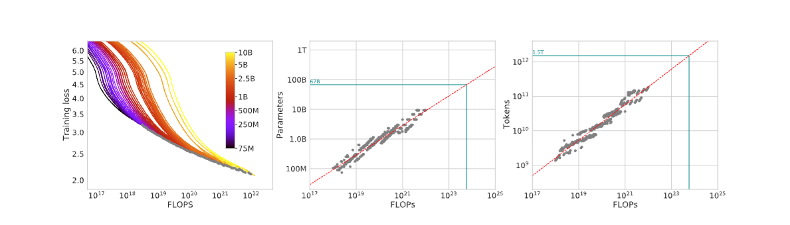
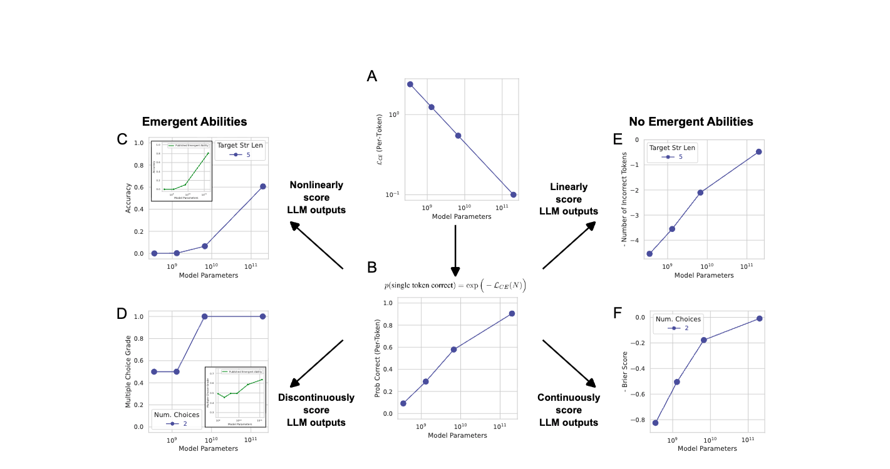
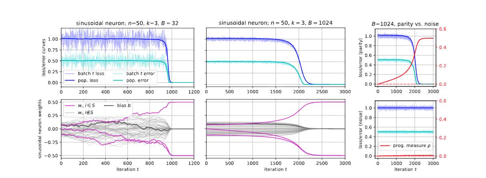
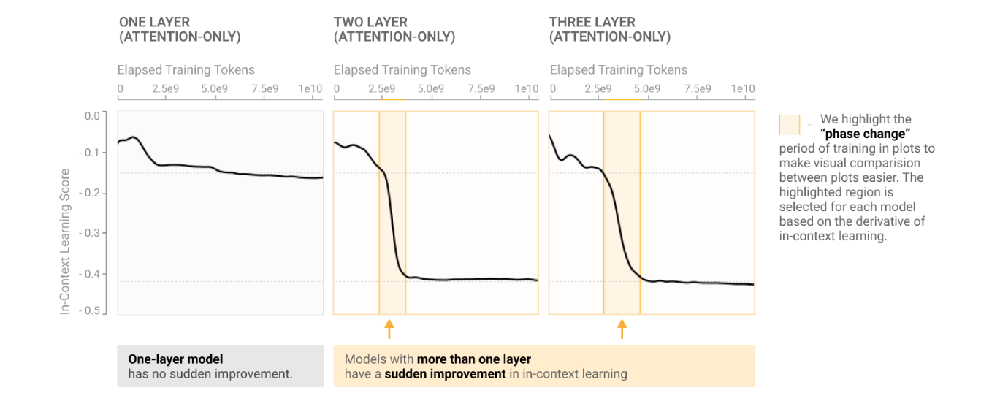
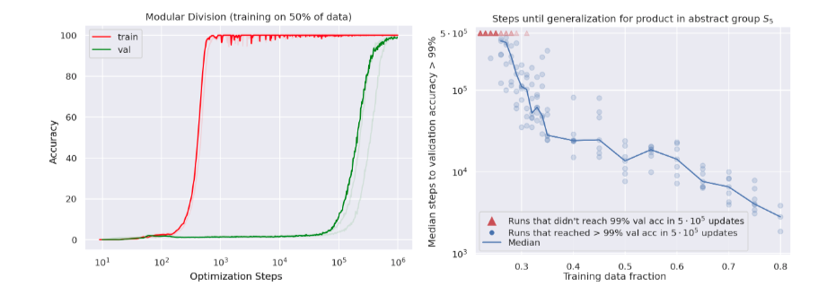

# Emergence during training

<!-- New slide starts here: use --- on its own line -->
---
<!-- _class: left-layout -->

## Mystery of emergence

As LLMs are trained with more compute, surprising capabilities emerge
*Wei et al. (2022), Figure 2: some capabilities appear abruptly once model scale crosses a threshold.*

<!-- This --- starts the next slide -->
---
## Hidden progress
New capabilities:

- Seem to appear suddenly as we use more compute
- Are often not predicted by the training signal (loss)

But: they involve reorganisation of internal representations that can be detected

---

## Physics analogy: phase transition
- More is different (Andersen): 
- More compute induces novel capabilities
- Intuition: rapid change in macroscopic behaviour driven by continuous change in control parameter (compute)
- Phase transition

---

## Scaling laws

Compute-optimal scaling laws (Chinchilla 2022)

---
## Mirage debate
-  Mirage: emergence is in the eye of the metric
-  But we do know about genuine phase transitions in models (e.g. grokking)
*Source: Schaeffer et al. (2023), Figure 2*

---
# Empirical examples of emergence 
---
## Silent alignment in DLNs

*Atanasov et al. (2021): Neural Networks as Kernel Learners: The Silent Alignment Effect*

---
## Sparse parity learning
- Task: SGD learns parity of a substring of bits
  - (n,k)-sparse parity string: get a random n-bit string
$$ y= \Pi_{j\in k} x_j $$
  - Learner sees (x,y) and must figure out k
- If SGD were random: $2^{O(n)}$ steps
- But SGD is not random: $n^{\Omega(k)}$ steps, polynomial (close to optimal)
---
## Sparse parity learning
*Hidden Progress in Deep Learning: SGD Learns Parities Near the Computational Limit*
- model: $f(w,x)=\sin(w^{\top}x+b)$
- progress measure: $p(t)=|wt-w_0|_{\infty}$

---

### Induction Heads

- During transformer training, a specific circuit forms: induction heads
- Pattern: [A][B] ... [A] → predict [B]
- *Catherine Olsson et al., "In-context Learning and Induction Heads"*

--- 

## Grokking

- Task: learn $(a,b)\mapsto a + b \ \text{mod} \ p$ with $p$ prime
- Model: Transformer (1 or 2 layers), MLP
- Cross-entropy loss

---
## Grokking

- *Alethea Power et al., "Grokking: Generalization Beyond Overfitting on Small Algorithmic Datasets" (Figure 1)*
-  Grokking as delayed generalization

---

## Transition from memorization to generalization

- Empirical LLC detects the transition, but does not predict it
- Lower-loss basins that generalize better also tend to have lower LLC
*Ben Cullen et al., "Grokking as a Phase Transition between Competing Basins: a Singular Learning Theory Approach" (Figure 3)*

---

## Emergent misalignment

*Jan Betley et al., "Emergent Misalignment: Narrow finetuning can produce broadly misaligned LLMs" (Figure 1)*

---

### Emergent misalignment as a phase transition

*Edward Turner et al., "Model Organisms for Emergent Misalignment" (Figure 10)*

---

### EM as a generalization issue

*Anna Soligo et al., "Emergent Misalignment is Easy, Narrow Misalignment is Hard" (Figure 1)*

---

### EM as a generalization issue

*Anna Soligo et al., "Emergent Misalignment is Easy, Narrow Misalignment is Hard" (Figure 5)*

---

### Discussion

- Examples of emergent behaviours not captured by the loss but that can be seen by a progress measure
- Sometimes can be understood as a lazy-to-rich transition (silent alignment, grokking)
- For alignment: emergent misalignment is relevant to understanding
