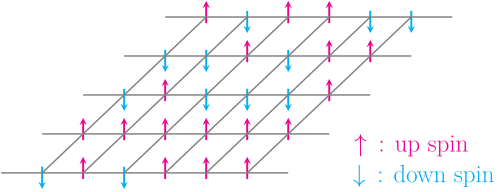
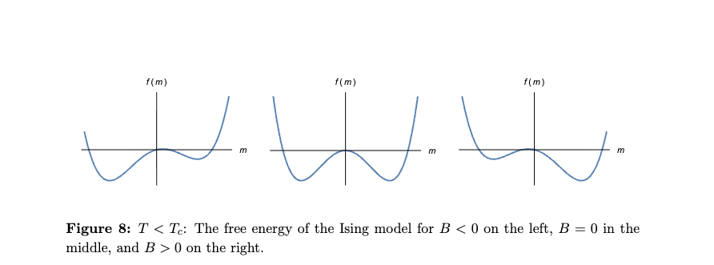
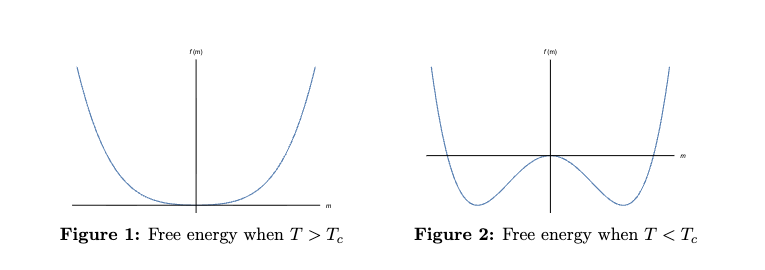

# Emergence during training

<!-- New slide starts here: use --- on its own line -->
---

## Mystery of emergence

Train LLMs and non-predicted capabilities emerge
*Wei et al. (2022), Figure 2: some capabilities appear abruptly once model scale crosses a threshold.*

<!-- This --- starts the next slide -->
---
## Key puzzle: hidden progress measures
New capabilities:

- Appear suddenly (not gradually)
- Are not predicted by the training signal (loss)
- Involve reorganisation of internal representations

---

## Physics analogy: phase transition
- More is different (Andersen): 
  - More compute induce novel capabilities
- Intuition: rapid change in macroscopic behaviour driven by continuous change in control parameter (compute)
  - Ex: liquid to gas or magnetisation
- A phase transition is a singularity in the Gibbs free energy

---

## Scaling laws

- Increase compute gets lower loss gets more capabilites
- Compute-optimal scaling laws (Chinchilla 2022)

---
## Mirage debate
-  Mirage: one metric's emergence is another metric continuous phenomena
-  But we do have evidence of rapid skill acquisition and qualitive change in models
*Source: Schaeffer et al. (2023), Figure 2*

---
# Empirical examples of emergence 
---
## Silent alignment in DLNs

*Atanasov et al. (2021): Neural Networks as Kernel Learners: The Silent Alignment Effect*

---
## Sparse parity learning
- Task: SGD learns parity of a substring of bits
  - (n,k)-sparse parity string: get random n-bits string
$$ y= \Pi_{j\in k} x_j $$
  - Learner sees (x,y) must figure out k
- If SGD random: $2^{O(n)}$ steps
- But SGD not random: $n^{\Omega(k)}$ steps, polynomial (close to optimal)
---
## Sparse parity learning
*Hidden Progress in Deep Learning: SGD Learns Parities Near the Computational Limit*

---

## Grokking

- *Alethea Power et al., "Grokking: Generalization Beyond Overfitting on Small Algorithmic Datasets" (Figure 1)*
-  Grokking as Delayed generalization

---

## Grokking Hidden progress measures:
*Source: Neel Nanda et al., "Progress measures for grokking via mechanistic interpretability" (Figure 7)*

---

## Transition from memorization to generalization

- Empirical LLC detects the transition, but does not predict it
- Lower-loss basins that generalize better also tend to have lower LLC
*Ben Cullen et al., "Grokking as a Phase Transition between Competing Basins: a Singular Learning Theory Approach" (Figure 3)*

---
### Induction Heads

- During transformer training, a specific circuit forms: induction heads
- Pattern: [A][B] ... [A] → predict [B]
- *Catherine Olsson et al., "In-context Learning and Induction Heads"*

---

## Emergent misalignment

*Jan Betley et al., "Emergent Misalignment: Narrow finetuning can produce broadly misaligned LLMs" (Figure 1)*

---

### Emergent misalignment as a phase transition

*Edward Turner et al., "Model Organisms for Emergent Misalignment" (Figure 10)*

---

### EM as a generalization issue

*Anna Soligo et al., "Emergent Misalignment is Easy, Narrow Misalignment is Hard" (Figure 1)*

---

### EM as a generalization issue

*Anna Soligo et al., "Emergent Misalignment is Easy, Narrow Misalignment is Hard" (Figure 5)*

---

# Theory

---

## Ising Model 

$$ H(S) = -B\sum_i S_i - \sum_{<i,j>}J_{ij} S_iS_j$$

$$Z = \sum_S \exp{-\beta H(S)}$$

---

## Mean field approximation

- Spins are independent and self averaging $\langle S\rangle = m =S$ i.e. neglect fluctuations
- Energy $E(m)=-Bm -\frac{1}{2}Jqm^2$
- Effective free energy $f(m) = E(m) - T\log\Omega(m)$
- Self-consistent equation in $m$ from equilibrium $\frac{\partial}{\partial m}f = 0$

---

## First order phase transition

Discontinuous change in magnetisation

---

## Second order phase transition 
Continuous change in magnetisation, sharp change in the topology of free energy

---

## Link with Deep neural networks

- Deep neural networks are stochastic (initialization, batches)
- Large number of interacting neurons (depth and width)
- Feels natural to apply statistical physics
- But they are also dynamical systems during training

---

# Dynamical Mean Field theory 

---

## Motivation

- Control and order parameters of DNNs?
- Explain empirical emergent phenomena with statistical field theoretic framework
- Relevant macro observables we can track during training for early warning, interpretability and control?

---

## Microscopic variables in DMFT

$$
f_\mu=\frac{1}{\gamma_0\sqrt{N}}\,h_\mu^{(L)}, \qquad
h_\mu^{(L)}=\frac{1}{\sqrt{N}}\,w^{(L)}\!\cdot\!\phi\!\left(h_\mu^{(L-1)}\right),
$$

$$
h_\mu^{(\ell)}=\frac{1}{\sqrt{N}}\,W^{(\ell)}\phi\!\left(h_\mu^{(\ell-1)}\right), \quad \ell=2,\dots,L-1,
\qquad
h_\mu^{(1)}=\frac{1}{\sqrt{D}}\,W^{(1)}x^\mu.
$$

$$
g_\mu^{(\ell)}=\sqrt{N}\,\frac{\partial h_\mu^{(L)}}{\partial h_\mu^{(\ell)}}, \qquad
g_\mu^{(\ell)}=\phi'\!\left(h_\mu^{(\ell)}\right)\odot z_\mu^{(\ell)}, \qquad
z_\mu^{(\ell)}=\frac{1}{\sqrt{N}}(W^{(\ell+1)})^\top g_\mu^{(\ell+1)},
$$

$$
g_\mu^{(L)}=\sqrt{N}.
$$
---
## Gradient flow dynamics

$$
\frac{d\theta}{dt}
=
\frac{\eta_0\gamma_0}{P}\sum_{\mu=1}^P
\Delta_\mu\,\frac{\partial h_\mu^{(L)}}{\partial \theta},
\qquad
\Delta_\mu=-\frac{\partial \ell_\mu}{\partial f_\mu},
$$

$$
\frac{df_\mu}{dt}
=
\frac{\eta_0}{P}\sum_{\alpha=1}^P
\Delta_\alpha\,K^{\mathrm{NTK}}_{\mu\alpha},
\qquad
K^{\mathrm{NTK}}_{\mu\alpha}
=
\frac{\partial h_\mu^{(L)}}{\partial \theta}\cdot
\frac{\partial h_\alpha^{(L)}}{\partial \theta}.
$$
---
## Order parameters

The order parameters are the forward and backward kernels:

$$
\Phi_{\mu\nu}^{(\ell)}(t,s)
=
\frac{1}{N}\,
\phi\!\left(h_\mu^{(\ell)}(t)\right)\!\cdot\!\phi\!\left(h_\nu^{(\ell)}(s)\right),
\qquad \ell=1,\dots,L-1,
$$

$$
G_{\mu\nu}^{(\ell)}(t,s)
=
\frac{1}{N}\,
g_\mu^{(\ell)}(t)\!\cdot\! g_\nu^{(\ell)}(s),
\qquad \ell=1,\dots,L,
$$

with input kernel and terminal condition

$$
\Phi_{\mu\nu}^{(0)}(t,s)=\frac{1}{D}\,x^\mu\!\cdot x^\nu,
\qquad
G_{\mu\nu}^{(L)}(t,s)=1.
$$

- $\Phi^{(\ell)}$ measures similarity of forward features at layer $\ell$
- $G^{(\ell)}$ measures similarity of backward sensitivity fields at layer $\ell$
- Mean field: in the infinite-width limit, these become the self-consistent macroscopic observables
---
## Path integral formulation

After introducing the order parameters with delta functions, the generating functional can be written as

$$
Z \propto
\int
\prod_{\mu,\alpha,t,s}
d\Phi_{\mu\alpha}(t,s)\,
d\hat{\Phi}_{\mu\alpha}(t,s)\,
dG_{\mu\alpha}(t,s)\,
d\hat{G}_{\mu\alpha}(t,s)\,
\exp\!\Big(N\,S[\Phi,\hat{\Phi},G,\hat{G}]\Big),
$$

with action

$$
S[\Phi,\hat{\Phi},G,\hat{G}]
=
\sum_{\mu,\alpha}\int dt\,ds\,
\Big[
\Phi_{\mu\alpha}(t,s)\hat{\Phi}_{\mu\alpha}(t,s)
+
G_{\mu\alpha}(t,s)\hat{G}_{\mu\alpha}(t,s)
\Big]
+
\frac{1}{N}\sum_{i=1}^N \ln Z[j_i,v_i].
$$

Large width: integral is dominated by the saddle point of the action $S$, which yields the DMFT self-consistency equations.

---
## Self-consistent DMFT equations

$$
\{\chi_\mu\}_{\mu\in[P]} \sim \mathcal N(0,\Phi^{(0)}),
\qquad
\xi \sim \mathcal N(0,1),
$$

$$
h_\mu(t)
=
\chi_\mu
+
\frac{\eta_0\gamma_0}{P}
\int_0^t ds \sum_{\alpha}
g_\alpha(s)\,\Phi^{(0)}_{\mu\alpha}\,\Delta_\alpha(s),
$$

$$
z(t)
=
\xi
+
\frac{\eta_0\gamma_0}{P}
\int_0^t ds \sum_{\alpha}
\phi\!\left(h_\alpha(s)\right)\Delta_\alpha(s),
\qquad
g_\mu(t)=\phi'\!\left(h_\mu(t)\right)\odot z(t),
$$

$$
\Phi_{\mu\alpha}(t,s)
=
\left\langle
\phi\!\left(h_\mu(t)\right)\phi\!\left(h_\alpha(s)\right)
\right\rangle,
\qquad
G_{\mu\alpha}(t,s)
=
\left\langle
g_\mu(t)g_\alpha(s)
\right\rangle,
$$

$$
\frac{\partial f_\mu}{\partial t}
=
\frac{\eta_0}{P}\sum_{\alpha}
\Big[
\Phi_{\mu\alpha}(t,t)
+
G_{\mu\alpha}(t,t)\Phi^{(0)}_{\mu\alpha}
\Big]\Delta_\alpha(t).
$$
---
## Interpreting the DMFT equations

- Replaces DNN by a **single representative neuron** evolving in random effective fields.
- Each sample influences the effective neuron through an average field.
- $\Phi_{\mu\alpha}(t,s)$ measures similarity of forward features, while $G_{\mu\alpha}(t,s)$ measures similarity of backward sensitivities.
- These kernels are the **order parameters**: they summarize the collective state of the whole network.
- The equations are **self-consistent** because $h,z$ determine $\Phi,G$, and $\Phi,G$ in turn determine the evolution of predictions.
- The result is a closed macroscopic description of learning dynamics, replacing many neurons by a few kernels.
---
## Applications
- Silent alignment in DLNs (see tutorial)
- Grokking as lazy to rich transition (see tutorial)
- Hope: step toward a theory of training that we can use to predict and control alignment

---
## Extensions of DMFT

- Finite-width corrections
- Renormalization
- Taking symmetries into account
- Other limits 
  - Large data: SLT
  - Large depth
- Computational tractability for solving DMFT equations?
- Other architectures, SGD, finite learning rate

---
## Some resources
- [Lecture Notes on Infinite-Width Limits of Neural Networks; Cengiz Pehlevan and Blake Bordelon](https://pehlevan.seas.harvard.edu/sites/g/files/omnuum6471/files/pehlevan/files/princeton_lecture_notes.pdf)
- [Disordered Dynamics in High Dimensions: Connections to Random Matrices and Machine Learning; Blake Bordelon, Cengiz Pehlevan](https://arxiv.org/abs/2601.01010)
- [Applications of Statistical Field Theory in Deep Learning; Zohar Ringel et. al](https://arxiv.org/abs/2502.18553)
- [Statistical Field Theory for Neural Networks, Moritz Helias, David Dahmen
](https://link.springer.com/book/10.1007/978-3-030-46444-8)
- [Lecture notes: From Gaussian processes to feature learning, Moritz Helias et al
](https://arxiv.org/abs/2602.12855
)
- [Grokking as a First Order Phase Transition in Two Layer Networks, Rubin et. al
](https://arxiv.org/abs/2310.03789)

