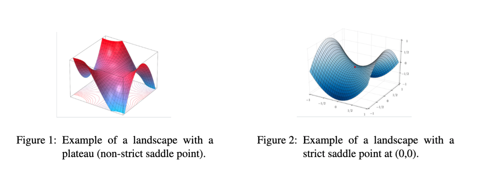
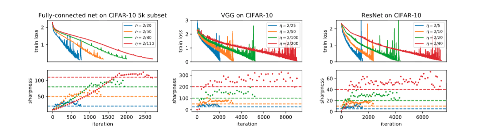
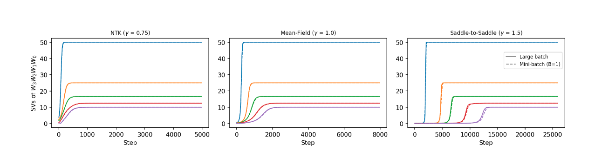
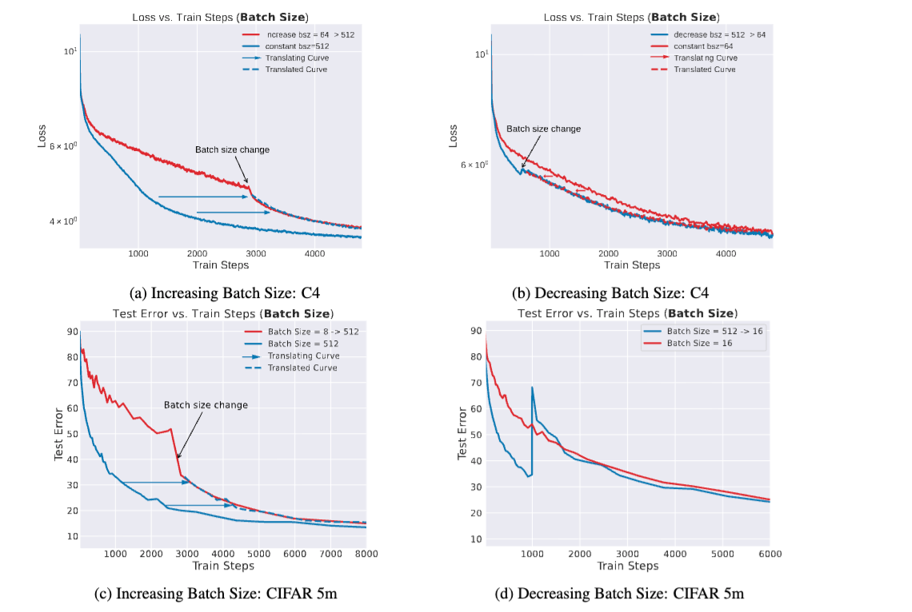

# Implicit regularization

--- 

## Explicit regularization

Parameter $\theta$ (large dim), data $x$ (large dim), loss $L(\theta,x)$, define regularized loss:

$$\mathcal{L}(\theta, x) = L(\theta,x) + \lambda R(\theta)$$

Weight decay:

$$R = ||\theta||_2^2 $$

---

## Why do we care?
- Contra naive statistics, Deep Neural Networks (DNN) generalize surprisingly well
- Implicit regularization must happen
- SLT tells us a story for Bayesian learning
- We want a training dynamics native theory of implicit regularization
- We want to understand how training progressively builds complex solutions from simple ones and what implicit biases 
- Implicit biases from structure of the data, scale (depth), loss, optimizer

---

## Implications for alignment

- Alignment is also a question about implicit regularization
- Observe policy $\pi(\theta,x)$: policy does well on the reward and looks aligned from behavioural tests
- But perhaps $\pi(\theta,x)$  is scheming (misaligned) 
- If no strong regularization for honest solutions then schemer more likely
- Hope 1: Understanding implicit bias help us shed light on this
- Hope 2: Design training process that selects schemers away

---

# Loss landscape geometry

---

## Critical points

- They gives the menu of solutions that are possible
- They shape the training dynamics
- $\nabla L(\theta, x)=0$

---
## Deep Linear Networks
Function (multilinear in parameters):
$$\begin{align*}
    f: \ & \mathbb{R}^{d_0} \times \prod_{l=0}^{L-1}\mathbb{R}^{d_l \times d_{l+1}}  \to \mathbb{R}^{d_L} \\
       & (x,W_1,...,W_L) \mapsto W_L...W_1 x = Wx
\end{align*}$$
Loss (can only learn linear maps): 
$$\begin{equation*}
    \mathcal{L}_N(\theta; D_N) = \frac{1}{2N} \sum_{i=1}^{N} ||y_i - W_L...W_1x_i||_2^2 = \frac{1}{2N} \sum_{i=1}^{N} ||Mx_i - Wx_i||_2^2 \to_N ||(M - W)\Sigma_X^{\frac{1}{2}}||^2_F
\end{equation*}$$
Non convex, high dimension loss landscape

---
## Symmetries 
Let $GL_{\textbf{d}}:=\Pi_{l=L}^0 GL_{d_l} = GL_{d_L}\times GL_{h} \times GL_{d_0}$ act on $\Omega$ via:
$$(W_1,\dots,W_L)\mapsto (g_1W_1g_0^{-1},\; g_2W_2g_1^{-1},\;\dots,\; g_L W_L g_{L-1}^{-1})$$
Define $\mu(\theta) = W$
$$\mu(g\cdot \theta)=g_LWg_0^{-1};\quad \mu(g_h\cdot \theta) = \mu(\theta) $$
Let $\theta\in \pi^{-1}(W)$, the orbit $\mathcal{O}_{\theta}:=G_{\mathrm{h}}\cdot \theta$ is a submanifold of the fiber $\mu^{-1}(W)$

---
## Global minima
- If $d_l \geq d_L$ unique in function space for $W = \Sigma_{YX}\Sigma_X^{-1}=M$ (OLS)
- Because of symmetries: infinitely degenerate parameters mapping to student
- Key geometric invariants: rank patterns $r_{ij}=\text{rank}(W_i...W_j)$
- Can stratify degenerate parameter mapping to global minima into $O_{r_{ij}}$ 
- Give combinatorial description of global minima  
- Can be used to compute codimension of global minima (relate with RLCT)
- See more at this [paper from Simon Pepin Lehalleur and Richárd Rimányi](https://arxiv.org/abs/2411.19920)
- The rank patterns quantify simplicity between degenerate solutions

---
## Saddle points 

In DLNs if $d_l \geq d_L$, full rank and non degenerate data: 
- All critical points are either saddles or
- Saddles can be strict or non strict
- They are also often highly degenerate (many flat directions) 
- This is generic in DNNs

Work in progress to get combinatorics of saddles with quiver representation theory (doable!)

---
## First order critical points

 Assume overparametrization and well-behaved data. Let $\theta$ be a first-order critical point of the population loss $\mathcal{L}$. From [Achour et. al](https://arxiv.org/abs/2107.13289), there exists $S$ a subset indexing the left singular vectors of: 
 $$W^{\star}=\Sigma_{YX}\Sigma_X^{-1} = U\text{diag}(s_1,...s_{d_L},0,...,0)V^{\top}$$
and $P_S:=U_SU_S^{\top}$ a linear projector onto the space of vectors indexed by the set $S$ such that:
 $$\begin{equation*}
        \pi(\theta) := W = W_L...W_1 = P_S W^{\star} = U_SU_S^{\top}\Sigma_{YX}\Sigma_X^{-1}
    \end{equation*}$$

--- 

## Takeaways
- Loss landscapes are highly degenerate
- Connected minima (mode connectivity)
- Under some conditions: no spurious local minima
- Can learn about important geometric invariant by studying their symmetries
- A world of topology, geometry, group representation theory

--- 
# Optimization

---
## Gradient descent

For parameters $\theta_t \in \mathbb{R}^p$, gradient descent updates:
$$
\theta_{t+1} = \theta_t - \eta \nabla \mathcal{L}(\theta_t)
$$

Interpretation:
- Move in the direction of steepest local decrease
- Step size $\eta$ controls speed vs stability

---
## Descent lemma and stability

If $\mathcal{L}$ is $L$-smooth, then for gradient descent with any $\eta < \frac{2}{L}$,
$$
\mathcal{L}(\theta_{t+1})
\le
\mathcal{L}(\theta_t)
-
\eta\left(1-\frac{\eta L}{2}\right)\|\nabla \mathcal{L}(\theta_t)\|_2^2
$$

Local stability near a minimum is controlled by the largest Hessian eigenvalue:
$$
L \approx \lambda_{\max}(H)
\qquad\Rightarrow\qquad
\eta < \frac{2}{\lambda_{\max}(H)}
$$

Hence:
- large curvature $\Rightarrow$ smaller stable learning rate
- sharp directions constrain optimization
- flat directions allow slow drift and can encode implicit bias
---
## Learning rate: Edge of stability
Loss non convex but Hessian overs above $\frac{2}{\eta}$: regularize away sharp minima

*[Gradient Descent on Neural Networks Typically Occurs at the Edge of Stability, Cohen et. al](https://arxiv.org/abs/2103.00065)*

---
## Gradient flow
---
## Gradient flow and NTK dynamics

Small learning rate limit of gradient descent:
$$
\theta_{t+1}=\theta_t-\eta \nabla_\theta \mathcal{L}(\theta_t)
\qquad \leadsto \qquad
\dot{\theta}(t)=-\nabla_\theta \mathcal{L}(\theta(t))
$$
Let $J_\theta(x)=\nabla_\theta f_\theta(x)$, define the Neural Tangent Kernel
$$
K_\theta(x,x') = J_\theta(x)J_\theta(x')^\top
$$

Then the prediction dynamics in function space are
$$
\frac{d}{dt}f_\theta(x,t)
=
-\sum_{i=1}^N K_\theta(x,x_i)\big(f_\theta(x_i,t)-y_i\big)
$$

On the training set, with $f(t)=(f_\theta(x_i,t))_{i=1}^N$ and $y=(y_i)_{i=1}^N$:
$$
\dot f(t) = -K(t)\big(f(t)-y\big)
$$

---
## Conserved quantities

DLN symmetries induced conserved quantities through the gradient flow: 
$$G_l = W_{l+1}^{\top}W_{l+1} - W_{l}W_{l}^{\top}$$
When $G_l=0$ we have balanced weights
See tutorial for more

---
## Self consistent equation in DLNs
 On the balanced variety $\mathcal{M}_0$ we have self consistent gradient flow equation in function space:
$$\begin{equation*}
    \dot{W} = \sum_{k=1}^{L}(WW^{\top})^{\frac{L-k}{L}}\nabla_W \mathcal{L}(W)(W^{\top}W)^{\frac{k-1}{L}}
\end{equation*}$$
i.e. 
$$\begin{equation*}
    \dot{W} = K[\mathcal{L}(W)]
\end{equation*}$$

---
## Macro dynamics
- Foliate balance manifold into $\mathbb{M}_r$ of rank $r$ students.
- Note $\mathcal{O}_W:=\mu^{-1}(W)$
- Entropy $S(W)=\log \text{Vol}(O_W)$
- Free energy: $F(W) = L(W) - \frac{1}{\beta}S(W)$
- GF on $\mathbb{M}_r$ lifts to $\dot{W}=-K[\nabla F(W)]$
- GF minimizes a free energy functional and entropy makes the regularization explicit
- See [The geometry of the deep linear network, Govid Menon](https://arxiv.org/abs/2411.09004)

---
## Lazy Regime
For a DLN of depth $L$ with initialization $\theta(0)\sim N(0,\sigma)$ and $\sigma^2 = d_L^{-\gamma}, \ \gamma < 1$:
$$
\begin{align*}
    \dot{W} & \approx K_0[M - W]
\end{align*}
$$
Leading to the following solution:
$$
\begin{equation*}
    W(t) = M - \exp(-K_0 t)[M - W(0)]
\end{equation*}
$$
The time scale of learning is mostly fixed by the NTK at initialization:
$$
\begin{equation*}
    t \approx -k_0^{-1}\log\left(\frac{s - w_f}{s - w_0}\right)
\end{equation*}
$$
- Behaves like a linear network
  - No regularization: bad for generalization
- Generic (works for any neural nets in large width limit)
---
## Rich regime

For balanced and aligned weights (or $\gamma >1$), GF reduces to a system of 1D logistic ODEs:
$$
\begin{equation*}
    \dot{w}_{\alpha} = 2\left(s_{\alpha} - w_{\alpha}\right)w_{\alpha}.
\end{equation*}
$$
Solving this ODE for $w(t):=w_{\alpha}$ gives:
$$
\begin{equation*}
    w(t)=\frac{s}{1+\left(\frac{s}{w_0}-1\right)e^{-2s t}}.
\end{equation*}
$$
Time scale of learning
$$
t=\frac{1}{2s}\,\ln\!\left(\frac{w_f\,(s-w_0)}{w_0\,(s-w_f)}\right), \qquad s\neq 0.
$$
---
## Regimes

---
# Stochasticity

---

## Langevin dynamics

- SGD: Take batches of a dataset and compute batch-gradient
- Continuous model with $B_t$ brownian
$$
d\theta_t=-\,g(\theta_t)\,dt+\sqrt{\eta\,\Sigma(\theta_t)}\,dB_t,
$$
- In general $\Sigma(\theta_t)$ depends on geometry: anisotropic and state dependent

---

## Fokker Planck: Boltzmann equilibria
Fokker–Planck (for density $p(\theta,t)$) is a local conservation law:
$$\begin{align*}
    \partial_t p & := - \nabla\cdot j \\
    j &:=- \nabla L(\theta)p(\theta) - \frac{\eta}{2}\nabla^\top\left(\Sigma(\theta)p(\theta)\right) 
 \end{align*}$$
Important special case:
- Stationary distribution: $\partial_tp^{\ast}(x,t) = 0$
- Thermal equilibrium: $j=0$ 
- White noise: $\Sigma=\sigma^2 I$ 
$$ p^{\ast}(\theta) \propto \exp\left(-\frac{2}{\eta\sigma^2}L_N(\theta)\right) \ \text{Boltzmann}$$

---
## Noise anisotropy

- In general noise is anisotropic: introduces different implicit bias at convergence
- In function space Langevin introduces an Ito induced drift
$$ \frac{\eta}{2}\text{Tr}(\Sigma(\theta)H(\theta)) $$
- It is a noise-weighted curvature bias
- More work: 
  - see Govind Menon [On the implicit regularization of Langevin dynamics with projected noise
](https://arxiv.org/abs/2602.12257)
  - My own work working out Langevin on DLNs

---
## Golden Path hypothesis
- Lots of debate about the implicit bias of SGD noise
- Transient vs low loss regime 

*Beyond Implicit Bias: The Insignificance of SGD Noise in Online Learning*

---
## Discussion
- We can identify implicit bias in DLNs
- Main theme is that there is a simplicity bias
- How strong matters for alignment
- Many open questions
  - Symmetry and macro dynamics
  - Beyond DLNs (gated DLNs, ReLU)
  - Structure of data (important)

