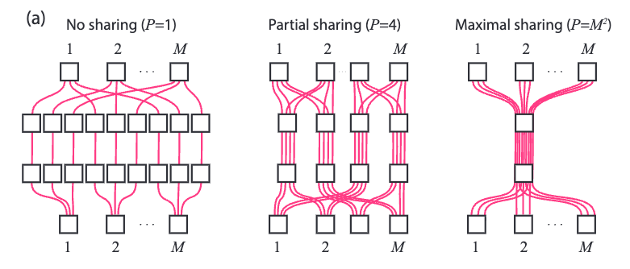
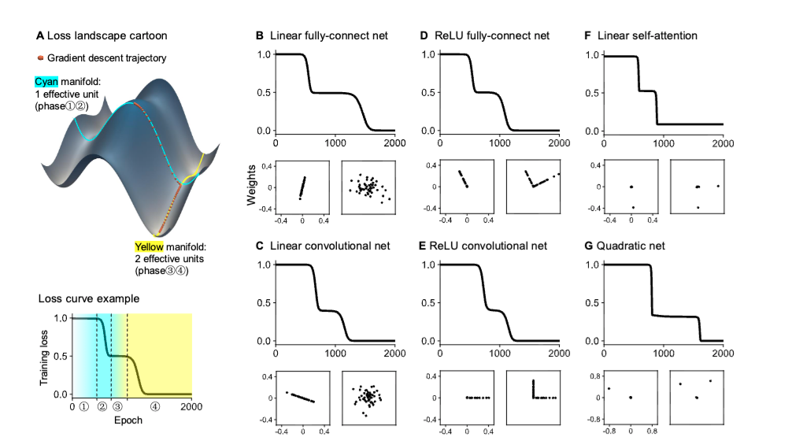

# Implicit regularization

Guillaume Corlouer

--- 

## Definition

$\Omega$: set of parameters; $L(\theta)$: population loss of a neural network $f(\theta,x)$ with input data $x$. 

Gradient descent: 

$$\Delta \theta_k = -\eta\nabla L(\theta_k)$$
 

Convergence to $\theta^{\star}\in \Omega^{\star}= \text{argmin}_{\theta} L(\theta)$

Implicit regularization: there exists a complexity function $R[\theta]$:

$$ \theta^{\star} = \text{min}_{\theta\in \Omega^{\star}} R[\theta] $$

GD prefers solutions within certain complexity classes

--- 

## Explicit regularization

Define regularized loss and optimize it:

$$\mathcal{L}(\theta, x) = L(\theta,x) + \lambda R(\theta)$$

Example weight decay:

$$R = ||\theta||_2^2 $$

---

## Why do we care?
- Contrary to naive statistics, deep neural networks (DNNs) generalize surprisingly well
- Implicit regularization must occur
- SLT tells us a story for Bayesian learning
- We want a theory of implicit regularization for SGD
- Implicit regularization from scale (depth), loss, optimizer, initialization,...

---

## Implications for alignment

- Alignment is also a question about implicit regularization
- Observe policy $\pi(\theta,x)$: the policy does well on the reward and looks aligned in behavioural tests
- But perhaps $\pi(\theta,x)$ is scheming (misaligned) because it is favoured by training
- If there is no strong regularization for honest solutions, then schemers are more likely
- Hope 1: Understanding implicit bias helps us detect scheming
- Hope 2: Design a training process that selects against schemers

---

# Loss landscape geometry

---

## Critical points

- They give the menu of possible solutions
- They shape the training dynamics
- $\nabla L(\theta)=0$

---
## Deep Linear Networks
Function (multilinear in parameters):
$$\begin{align*}
    f: \ & \mathbb{R}^{d_0} \times \prod_{l=0}^{L-1}\mathbb{R}^{d_l \times d_{l+1}}  \to \mathbb{R}^{d_L} \\
       & (x,W_1,...,W_L) \mapsto W_L...W_1 x = Wx
\end{align*}$$

Function $W$ (student) learns $M$ (teacher)

We train on data generated by $y=Mx$ with quadratic loss and input covariance matrix $\Sigma_X = I$:
$$\begin{equation*}
    \mathcal{L}_N(\theta; D_N) = \frac{1}{2N} \sum_{i=1}^{N} ||y_i - W_L...W_1x_i||_2^2 = \frac{1}{2N} \sum_{i=1}^{N} ||Mx_i - Wx_i||_2^2 \to_N ||(M - W)||^2_F
\end{equation*}$$
Non-convex, high-dimensional loss landscape

---
## Symmetries 
Let $GL_{\textbf{d}}:=\Pi_{l=L}^0 GL_{d_l} = GL_{d_L}\times GL_{h} \times GL_{d_0}$ act on $\Omega$ via:
$$\theta=(W_1,\dots,W_L)\mapsto (g_1W_1g_0^{-1},\; g_2W_2g_1^{-1},\;\dots,\; g_L W_L g_{L-1}^{-1})$$
Define $\mu(\theta) = W$
$$\mu(g\cdot \theta)=g_LWg_0^{-1};\quad \mu(g_h\cdot \theta) = \mu(\theta) $$
Let $\theta\in \pi^{-1}(W)$, the orbit $\mathcal{O}_{\theta}:=G_{\mathrm{h}}\cdot \theta$ is a subspace of the fiber $\mu^{-1}(W)$

---
## Global minima
- If $d_l \geq d_L$, there is a unique solution in function space for $W^{\star} = \Sigma_{YX}=M$ (OLS), with $\Sigma_{YX}$ the input-output covariance
- A whole space of parameters maps to the solution (degenerate)
- Key geometric invariants under symmetries: rank patterns $r_{ij}=\text{rank}(W_i...W_j)$
- Can stratify the degenerate parameters mapping to global minima into $O_{r_{ij}}$
- Gives a combinatorial description of global minima
- Can be used to compute the dimension of global minima (link with RLCT)
- See more at this [paper from Simon Pepin Lehalleur and Richárd Rimányi](https://arxiv.org/abs/2411.19920)
- Informally: the rank patterns quantify simplicity among degenerate solutions

---
## Saddle points 

In DLNs, if $d_l \geq d_L$, with full-rank and non-degenerate data:
- **All critical points are either saddles or global minima**
- Saddles can be strict or non-strict
- They are also often highly degenerate (many flat directions) 
- This is generic in DNNs

Work is in progress to get the combinatorics of saddles with quiver representation theory

---
## First order critical points

 Assume $d_l\geq d_L$ and well-behaved data. Let $\theta$ be a critical point of the population loss $\mathcal{L}$. 
 
 From [Achour et al.](https://arxiv.org/abs/2107.13289), there exists a subset $S$ indexing the left singular vectors of:
 $$W^{\star}= M = U\text{diag}(s_1,...s_{d_L},0,...,0)V^{\top}$$
such that for $P_S:=U_SU_S^{\top}$ a linear projector onto the space of vectors indexed by the set $S$:
 $$\begin{equation*}
        \mu(\theta) := W = W_L...W_1 = P_S W^{\star} = U_SU_S^{\top}\Sigma_{YX}\Sigma_X^{-1}
    \end{equation*}$$

--- 

## Takeaways
- Loss landscapes are highly degenerate
- Under some conditions: local minima are global
- Discover geometric invariants by studying their symmetries
- A world of topology, geometry, group representation theory

--- 
# Learning Rate

---
## Descent lemma and stability

If $\mathcal{L}$ is convex and $\sigma$-smooth, then for gradient descent with any $\eta < \frac{2}{L}$,

$$
\mathcal{L}(\theta_{t+1})
\le
\mathcal{L}(\theta_t) - 
\eta\left(1-\frac{\eta \sigma}{2}\right)\|\nabla \mathcal{L}(\theta_t)\|_2^2
$$

Local stability near a minimum is controlled by the largest Hessian eigenvalue:
$$
\sigma \approx \lambda_{\max}(H)
\qquad\Rightarrow\qquad
\eta < \frac{2}{\lambda_{\max}(H)}
$$

Stability threshold ensuring monotonic decrease of the loss in convex optimization

---
## Edge of stability
The loss is non-convex, but the Hessian oscillates slightly above $\frac{2}{\eta}$: it regularizes away sharp minima

*[Gradient Descent on Neural Networks Typically Occurs at the Edge of Stability, Cohen et al.](https://arxiv.org/abs/2103.00065)*

---
## Gradient flow
---
## Gradient flow and NTK dynamics

Small-learning-rate limit of gradient descent:
$$
\theta_{t+1}=\theta_t-\eta \nabla_\theta \mathcal{L}(\theta_t)
\qquad \leadsto \qquad
\dot{\theta}(t)=-\nabla_\theta \mathcal{L}(\theta(t))
$$
Neural Tangent Kernel (NTK):
$$
K(x,x',\theta) = \nabla_{\theta} f(\theta, x) \nabla_{\theta} f^{\top}(\theta, x) = \sum_{i=1}^p \partial_{\theta_i} f(\theta, x) \partial_{\theta_i} f^{\top}(\theta, x)
$$

For a quadratic loss on a dataset $(x_i,y_i)$, the dynamics in function space are
$$
\frac{d}{dt}f(\theta, x)
= -\sum_{i=1}^N K_{\theta}(x,x_i)\big(f_{\theta}(x_i,t)-y_i\big)
$$

---
## Conserved quantities

Conserved quantities under gradient flow:
$$G_l = W_{l+1}^{\top}W_{l+1} - W_{l}W_{l}^{\top}$$
When $G_l=0$ we have **balanced weights**

For a 1D, 2-layer DLN, we get a hyperbolic equation: $w_2^2 - w_1^2 = G$

See the tutorial for more

---
## Self-consistent equation in DLNs
Balanced weights $\implies$ self-consistent gradient-flow equation in function space:
$$\begin{equation*}
    \dot{W} = \sum_{k=1}^{L}(WW^{\top})^{\frac{L-k}{L}}\nabla_W \mathcal{L}(W)(W^{\top}W)^{\frac{k-1}{L}}
\end{equation*}$$
With operator $K: Q \mapsto \sum_{k=1}^{L}(WW^{\top})^{\frac{L-k}{L}} Q(W^{\top}W)^{\frac{k-1}{L}}$
$$\begin{equation*}
    \dot{W} = K[\nabla\mathcal{L}(W)]
\end{equation*}$$

---
## Heuristic implicit regularization
- Consider balanced weights of rank-$r$ students.
- Recall $\mu^{-1}(W)$ has many symmetries: rank patterns
- The singular values of weight $W^l$ are $\sigma^l_i$, and $p_k = \frac{\sigma^l_k}{\sum_k \sigma^l_k}$
- Spectral Entropy: $H^l(p)= - \sum_k p_k \log(p_k)$
- Entropy $S(W)=\sum_{l=1}^L H^l(p)$
- Free energy: $F(W) := L(W) - \frac{1}{\beta}S(W)$ with inverse temperature $\beta$
- Recall GF is $\dot{W}=-K[\nabla L(W)]$
- GF effectively minimizes a free energy functional, and entropy makes the regularization explicit
- For more, see [The geometry of the deep linear network, Govind Menon](https://arxiv.org/abs/2411.09004)
---
# Initialization
---
## Lazy Regime (NTK regime)
For a DLN of depth $L$ with initialization $\theta(0)\sim N(0,\sigma)$ and $\sigma^2 = d_L^{-\gamma}, \ \gamma < 1$:
$$
\begin{align*}
    \dot{W} & \approx K_0[M - W]
\end{align*}
$$
Leading to the following solution:
$$
\begin{equation*}
    W(t) = M - \exp(-K_0 t)[M - W(0)]
\end{equation*}
$$
The time scale of learning is fixed by the NTK at initialization:
$$
\begin{equation*}
    t \approx -k_0^{-1}\log\left(\frac{s - w_f}{s - w_0}\right)
\end{equation*}
$$

Behaves like a linear network with no simplicity bias

---
## Rich regime

For balanced and aligned weights (or $\gamma >1$), GF reduces to a system of 1D logistic ODEs:
$$
\begin{equation*}
    \dot{w}_{\alpha} = 2\left(s_{\alpha} - w_{\alpha}\right)w_{\alpha}.
\end{equation*}
$$
Solving this ODE for $w(t):=w_{\alpha}$ gives:
$$
\begin{equation*}
    w(t)=\frac{s}{1+\left(\frac{s}{w_0}-1\right)e^{-2s t}}.
\end{equation*}
$$
Timescale of learning
$$
t=\frac{1}{2s}\,\ln\!\left(\frac{w_f\,(s-w_0)}{w_0\,(s-w_f)}\right), \qquad s\neq 0.
$$

---
## Regimes

---

# Other architectures

---

## Nonlinearity: neural race reduction

*The Neural Race Reduction: Dynamics of Abstraction in Gated Networks, Andrew M. Saxe et al.*

--- 

## MLP and linear transformers

*Saddle-to-Saddle Dynamics Explains A Simplicity Bias Across Neural Network Architectures, Saxe et al.*

---

# Stochasticity

---

## Langevin dynamics

- SGD: Sample a batch from a dataset and compute the batch gradient
- Continuous model with $B_t$ Brownian
$$
d\theta_t=-\nabla L(\theta_t)\,dt+\sqrt{\eta\,\Sigma(\theta_t)}\,dB_t,
$$
- Gradient noise covariance $\Sigma(\theta_t)$ depends on geometry: it is anisotropic and state-dependent

---

## Fokker-Planck: Boltzmann equilibria
The Fokker-Planck equation (for density $p(\theta,t)$) is a local conservation law:
$$\begin{align*}
    \partial_t p & := - \nabla\cdot j \\
    j &:=- \nabla L(\theta)p(\theta) - \frac{\eta}{2}\nabla^\top\left(\Sigma(\theta)p(\theta)\right) 
 \end{align*}$$
Important special case:
- Stationary distribution: $\partial_tp^{\ast}(x,t) = 0$
- Thermal equilibrium: $j=0$ 
- White noise: $\Sigma=\sigma^2 I$ 
$$ p^{\ast}(\theta) \propto \exp\left(-\frac{2}{\eta\sigma^2}L_N(\theta)\right) \ \text{Boltzmann}$$

---
## Noise anisotropy

- In general, noise is anisotropic: it introduces a different implicit bias
- In function space, Langevin introduces a drift
$$ \frac{\eta}{2}\text{Tr}(\Sigma(\theta)H(\theta)) $$
- Heuristic: bias toward flatter minima
- More: 
  - see Govind Menon [On the implicit regularization of Langevin dynamics with projected noise
](https://arxiv.org/abs/2602.12257)
  - My [paper](https://arxiv.org/html/2604.06366v1) with collaborators deriving Langevin on DLNs during the saddle-to-saddle regime

---
## Golden Path hypothesis
- Lots of debate about the implicit bias of SGD noise
- Transient (drift dominated) vs low-loss regime (diffusion dominated):

*Beyond Implicit Bias: The Insignificance of SGD Noise in Online Learning*

---
## Discussion
- Implicit bias: making explicit the class of solutions that the training process selects
- Different causes of implicit regularization
- Often there is a simplicity bias
- How strong it is matters for alignment
- Many open questions
  - Mostly, we understand DLNs, but not fully
  - Beyond DLNs (gated DLNs, ReLU)
  - Structure of the data (important)
